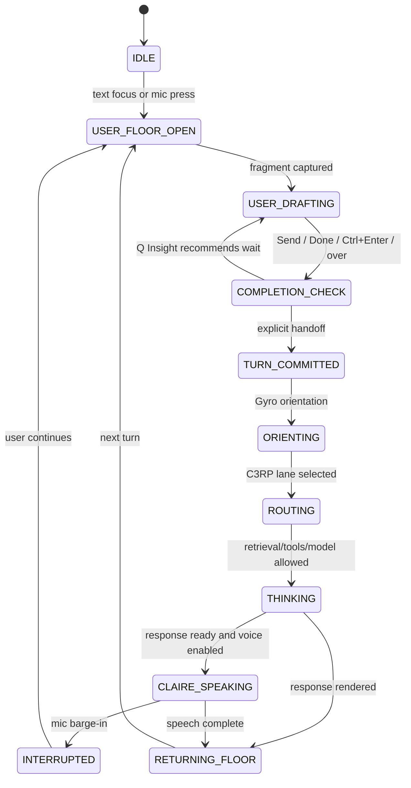

# 3CRP Turn Commit Control

## Purpose

3CRP prevents CLAIRE from treating fragments, Enter presses, or short voice pauses as completed user requests. Retrieval, memory, tools, model calls, and TTS are allowed only after a committed turn.

## State Machine



## Implemented Controls

- Text input is a draft buffer.
- Enter inserts a newline.
- Ctrl+Enter, Send, Done, Mic stop, or saying `over` commits the turn.
- Voice recognition is continuous; short pauses do not submit.
- Long-silence auto-commit exists but defaults to off.
- Startup does not auto-speak the welcome text.
- The introduction is available through `Play Introduction`.
- TTS is interrupted when the user opens the microphone.
- Committed turn metadata is sent with `/reply-stream` and appended to the trace log as `three_crp_turn_commit`.

## Metrics

The UI tracks:

- fragments merged per committed turn
- premature model calls prevented
- retrieval calls prevented
- generated tokens avoided
- input tokens avoided
- average open-turn duration
- explicit versus automatic commits
- false early commits
- false delayed commits
- TTS interruptions

Sample display:

```text
3CRP: 3 fragments merged | 2 premature model calls prevented | 2 retrieval calls prevented | avg open turn 8.4s | auto-send off
```

## Verification

Focused tests cover:

- three text fragments before Send
- voice pauses without commit
- `hold on` continuation detection
- user interruption during speech
- topic changes before commit
- explicit Done commit
- silence timeout enabled and disabled
- uncertain Q Insight result
- provider failure after commitment
- draft restore after refresh

